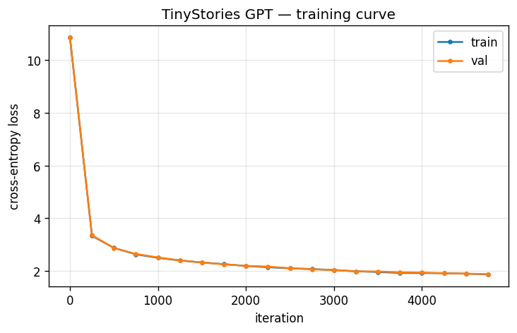

# nanogpt-tinystories

**A ~30M-parameter GPT-2-style transformer, built from scratch in pure PyTorch and
trained on TinyStories until it writes coherent little children's stories.**


[](https://colab.research.google.com/github/yashgarg4/nanogpt-tinystories/blob/main/notebooks/train_colab.ipynb)

No `transformers` library, no `AutoModel`, no pretrained weights. Every core
component — tokenization, embeddings, causal self-attention, the transformer
block, the training loop, and sampling — is implemented **and explained** by hand.
The goal is **understanding transformers from the inside**. The code is heavily commented to match.

## What it does

Trained from **random initialization** on TinyStories, it continues a prompt like
`"Once upon a time"` into a short, mostly-coherent story — a real result from this
repo's model (val loss 1.88, temperature 0.8, top-k 200):

> Once upon a time, there was a little girl named Lily. She loved to play with her
> jewelry and pretend she was a princess. One day, she went to the park to play
> with her jewelry. But when she saw her toy box, a big dog tried to take it from
> her. Lily was sad and started to cry. Her mommy told her not to worry and that
> the dog was not a real friend... Later that day, Lily's friend came over to play.
> Lily was so happy to have her shiny jewelry box back. She promised to always be
> careful and respectful with it. From that day on, Lily and her friends played
> with her jewelry box, and the dog never grabbed it again.

More in [`samples/`](samples/): the same model at different temperatures
([`gallery.md`](samples/gallery.md)), and the before/after contrast between an
under-trained checkpoint ([`sample_smoke_iter300.md`](samples/sample_smoke_iter300.md),
val 3.85 — rambling) and the final model
([`sample_final_iter4750.md`](samples/sample_final_iter4750.md), val 1.88 — coherent).

## From scratch means

The weights start as **random numbers**, and we write the attention mechanism, the
transformer blocks, and the training loop **ourselves**. We reuse GPT-2's
*tokenizer* (via `tiktoken`) because turning text into integers is a solved,
non-learning step — the **model** is what we're here to build and understand.

## Architecture

```
 token ids (B,T)
      │  wte[id] + wpe[pos]           (token + position embeddings)
      ▼
 ┌───────────────────────────────┐
 │ Transformer block  × 6        │   x = x + CausalSelfAttn(LayerNorm(x))   ← communicate
 │  (pre-norm, residual)         │   x = x + MLP(LayerNorm(x))              ← compute
 └───────────────────────────────┘
      ▼  final LayerNorm
 lm_head (Linear 384→50257)          ← weight-TIED to wte
      ▼
 logits (B,T,50257) → softmax → next token
```

Causal self-attention (per block): project to Q/K/V → split into 6 heads of 64 →
`softmax(Q·Kᵀ/√64 + causal_mask)·V` → concat heads → output projection. The causal
mask hides the future so each position predicts the next token from its past only.

## Concepts that were learned

Tokenization & BPE · token + position embeddings · scaled dot-product self-attention
· the causal mask · multi-head attention · the MLP / 4× feed-forward · residual
connections & pre-LayerNorm · weight tying · cross-entropy loss · backprop & AdamW ·
warmup + cosine LR schedule · perplexity · temperature & top-k sampling.

## Tech stack

Pure **PyTorch** for the model (the only deep-learning dependency) · `tiktoken`
(GPT-2 BPE) · `numpy` (memory-mapped `.bin` data) · `datasets` (download
TinyStories) · `tqdm` · `matplotlib`. **Not used:** `transformers` or any prebuilt
attention/GPT.

## Quick start

### Train on a free Colab T4 (~30–40 min)

Click the **Open in Colab** badge above → `Runtime → Change runtime type → T4 GPU`
→ `Runtime → Run all`. The notebook tokenizes TinyStories, trains 5000 iters to
~1.7–1.9 val loss, generates stories, and plots the loss curve.

### Or run locally

```bash
python -m venv .venv
source .venv/bin/activate            # Windows: .venv\Scripts\activate
pip install -r requirements.txt

python -m src.data                   # download + tokenize -> data/*.bin
python -m src.train                  # train (GPU recommended; CPU works but slow)
python -m src.generate --prompt "Once upon a time" --temperature 0.8 --top-k 200
```

## Training details

| Setting | Value |
|---|---|
| Parameters | ~30.0M (19.3M embeddings, 10.6M non-embedding) |
| Layers / heads / emb-dim | 6 / 6 / 384 |
| Context length (block size) | 256 tokens |
| Vocabulary | 50,257 (GPT-2 BPE) |
| Dataset | TinyStories — 474M train / 4.8M val tokens |
| Optimizer | AdamW (β 0.9/0.95, wd 0.1), grad clip 1.0 |
| LR schedule | 1e-3 peak, warmup + cosine decay to 1e-4 |
| Iterations | 5000 (batch 32 × 256 tokens) |
| Precision | float16 on T4 / bfloat16 on Ampere+ / float32 on CPU |
| **Final val loss** | **1.88** (perplexity ≈ 6.5) |
| Hardware / time | free Colab T4, ~30–40 min |

### Loss curve

Validation loss falls from ~10.87 (random init ≈ ln 50257) to **1.88** over 5000
iterations:



## Project structure

```
nanogpt-tinystories/
├── src/
│   ├── config.py       # GPTConfig + TrainConfig dataclasses
│   ├── tokenizer.py    # tiktoken GPT-2 BPE wrapper
│   ├── data.py         # download + tokenize -> data/train.bin, data/val.bin
│   ├── model.py        # the GPT, built by hand (attention, blocks, generate)
│   ├── train.py        # training loop (AdamW, LR schedule, checkpointing)
│   ├── generate.py     # autoregressive sampling (temperature, top-k)
│   └── utils.py        # param count, get_batch, estimate_loss, LR schedule
├── notebooks/
│   └── train_colab.ipynb   # one-click free-Colab T4 runner
├── samples/            # generated stories, the gallery, and the loss curve
├── data/               # train.bin / val.bin (gitignored, regenerated)
├── checkpoints/        # saved model (gitignored)
├── INTERNAL_NOTES.md   # the "textbook": every concept explained + build log
├── requirements.txt · Makefile · README.md
```

## Limitations

It's a small model trained only on TinyStories, so it knows nothing beyond that
world: simple vocabulary, 2–4-year-old-level plots, no facts about the real world,
and it occasionally repeats a noun or makes a small logical slip. That's expected
and fine — the point of this project is to *understand* how a transformer works by
building one, not to compete with large models.
